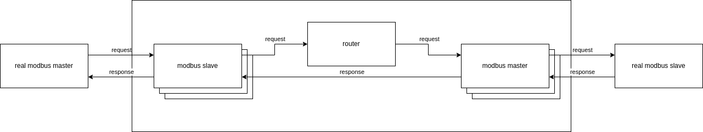

# modbus_gateway
Modbus Gateway is an open source convertor modbus message.  
Features:
- Multi master
- TCP transport with TCP modbus message
- RTU transport with RTU and ASCII modbus message
- RTU support RS485 configuration
- Crosscompile ARM, ARM64

## Get and build
Get source
```sh
git clone https://github.com/petukhovtd/exchange.git
cd exchange
```
Build and run docker
```sh
docker build . -t mg-image

docker run --rm \
  -it \
  --name mg-build \
  -v "$(pwd)":/app \
  mg-image:latest
  
cd app
```
Configure and build
```sh
mkdir "build"
cd build
cmake .. 
# or select toolchain arm
cmake .. -DCMAKE_TOOLCHAIN_FILE=./toolchain/arm.cmake
# or select toolchain arm64
cmake .. -DCMAKE_TOOLCHAIN_FILE=./toolchain/arm64.cmake
# build
make -j$(nproc)
```
### Socat
You can use socat for create virtual serial port
```sh
socat -d -d pty,raw,echo=0,link=port1 pty,raw,echo=0,link=port2
```
## Main idea

## Config file
### Service
log_level - (trace|debug|info|warning|error|critical)  
threads - threads count using in service
```json
"service": {
"log_level": "trace",
"threads": 1
}
```
### Slaves
It is array with modbus slave
- frame_type - (tcp|rtu|ascii)    
- frame_type tcp
  - (optional) ip_address - tcp server address
  - ip_port - tcp server port
- frame_type rtu|ascii
  - device - path to serial port
  - (optional) baud_rate - default 0 
  - (optional) character_size - default 8 
  - (optional) parity - default "none" 
  - (optional) stop_bits - default 1 
  - (optional) flow_control - default "none" 
  - (optional) rs485 - enable RS485
    - (optional) rts_on_send - default from device
    - (optional) rts_after_send - default from device
    - (optional) rx_during_tx - default from device
    - (optional) terminate_bus - default from device
    - (optional) delay_rts_before_send - default from device
    - (optional) delay_rts_after_send - default from device
```json
{
  "frame_type": "tcp",
  "ip_address": "192.168.1.2",
  "ip_port": 502
},
{
    "frame_type": "ascii",
    "device": "/dev/ttyUSB1",
    "baud_rate": 9600,
    "character_size": 8,
    "parity": "none",
    "stop_bits": 2,
    "flow_control": "none",
    "rs485": {
        "rts_on_send": true,
        "rts_after_send": false,
        "rx_during_tx": true,
        "terminate_bus": false,
        "delay_rts_before_send": 1000,
        "delay_rts_after_send": 2000
    }
}
```
### Masters
It is array with modbus master
- frame_type - (tcp|rtu|ascii)
- timeout_ms - time for wait response from real modbus slave
- frame_type tcp
    - ip_address - tcp client address
    - ip_port - tcp client port
- frame_type rtu|ascii (as in slave)
- (optional) uint_id - only one master can don't have uint_id - it is default master  
other masters have to have uint_id array
  - type - (range|value)
  - type range
    - begin - start range
    - end - end rage
  - type value
    - value - value
```json
{
    "frame_type": "tcp",
    "timeout_ms": 1000,
    "ip_address": "192.168.2.2",
    "ip_port": 502
},
{
    "frame_type": "rtu",
    "timeout_ms": 1000,
    "device": "/dev/ttyUSB2",
    "baud_rate": 115200,
    "character_size": 8,
    "parity": "even",
    "stop_bits": 1,
    "flow_control": "none",
    "unit_id": [
        {
            "type": "range",
            "begin": 10,
            "end": 20
        },
        {
            "type": "value",
            "value": 25
        }
    ]
}
```